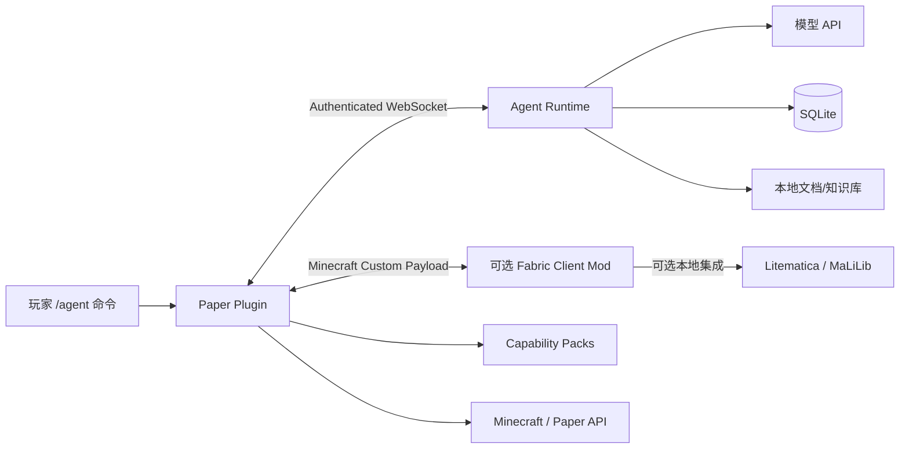

# Minecraft Agent — Vibe Coding 落地计划书

> 目标：使用 Codex 分阶段实现一个 **Paper 服务端插件 + 本地 Agent Runtime + 可选 Fabric 客户端 Mod** 的 Minecraft 助手。
> 核心能力：游戏内私密问答、可固定的富文本/物品图标悬浮窗、会话恢复、模块路由、服务器状态读取、配方可视化、Litematica 建筑投影与修改预览，以及通过受控 Capability 执行服务器能力。
> 核心安全原则：**开放能力描述，不开放任意执行。**

---

## 0. 已确定的产品决策

以下内容视为本项目的固定基线，除非后续明确修改：

1. 服务端使用 **Paper 插件**；玩家不安装客户端 Mod 也能使用聊天降级功能，但首版同时提供可选 **Fabric 客户端 Mod**，用于悬浮窗、物品图标和 Litematica 联动。
2. 玩家只通过 `/agent` 命令交互，不监听普通聊天。
3. Agent Runtime 由服主本地部署。
4. 一个服务器共用一个模型 API Key，费用由服主承担。
5. API Key 从本地配置文件或环境变量读取。
6. 只有核心启动自检成功，Paper 才注册 `/agent`。
7. 世界状态和玩家状态修改仅允许 OP 玩家。
8. Agent 不拥有任意 Shell、任意文件系统或任意控制台执行工具。
9. 已知插件能力通过 Typed Tool 或 Capability Pack 暴露。
10. 未知命令默认只能分析、建议和生成 Capability 草案，不能自动执行。
11. `/agent off` 可在不停服时紧急停用 Agent。
12. Offline 状态下，除 `/agent on` 和 `/agent off` 外，所有 `/agent` 命令统一返回：

```text
AI offline
```

13. `/agent on` 必须重新通过核心自检后才能恢复。
14. 手动 Offline 状态需要持久化，重启后不会自动恢复。
15. Agent Loop 使用成熟、普适的工具调用循环，不自行发明复杂编排框架。
16. 客户端 Mod 只负责展示、交互和本地投影，不是权限或执行边界；客户端回传内容一律按不可信数据处理。
17. 检测到兼容的 Litematica 时，`build` 必须优先使用其投影和原生 Material List HUD；不得用聊天文本冒充投影或材料清单。
18. 无客户端 Mod 或 Litematica 不兼容时必须明确降级，不得影响 `/agent`、只读查询及服务端安全能力。
19. Runtime 只支持显式列出的固定 Provider 协议适配器；自定义 URL 是服主对凭据和请求数据的信任决定，不自动回退、轮换或猜测协议。

---

# 1. 项目边界

## 1.1 第一版必须实现

- `/agent say <message>`
- `/agent resume [session]`
- `/agent module list`
- `/agent module <module> <message>`
- `/agent status`
- `/agent doctor`
- `/agent reload`
- `/agent capabilities`
- `/agent costs`
- `/agent ui pin|unpin|clear`
- `/agent off`
- `/agent on`
- Paper 与 Agent Runtime 的本地安全通信
- 模型 API 调用
- 会话持久化
- 工具调用循环
- 玩家和服务器只读上下文
- OP 权限判断
- Tool Policy
- Capability Manifest 加载与校验
- 危险操作 proposal + 玩家确认
- 紧急停机与运行中任务拦截
- 日志、审计和基础费用统计
- 可选 Fabric 客户端 Mod、客户端能力握手和版本协商
- 可固定/取消固定的输出悬浮窗，支持文本、物品堆图标和交互式列表
- `recipe` 结构化配方面板；聊天栏只作为无 Mod 玩家的降级输出
- Litematica 投影预览、原生 Material List HUD 调用和建筑变更预览

## 1.2 第一版建议包含的基础模块

- `general`：通用问答与自动路由
- `recipe`：配方和物品用途查询；客户端可视化配方网格和物品图标
- `guide`：攻略、服务器规则和文档问答
- `locate`：地标查询和距离排序
- `build`：建筑规划、区域修改、Litematica 投影预览和材料清单
- `project`：保存和恢复建筑项目

## 1.3 第一版不做

- 自动挖掘、自动寻路、无人值守的持续自动建造（已预览并确认的有界变更集不属于此项）
- 任意控制台命令执行
- 任意 Java 反射调用
- 任意 Shell、Python 或脚本执行
- JEI/EMI/REI Bridge（配方 UI 由本项目客户端 Mod 自行渲染）
- NeoForge 客户端适配器（首版客户端仅支持 Fabric）
- Litematica Easy Place、自动放置或绕过玩家操作的客户端自动建造
- 在未确认 proposal 的情况下把投影直接写入世界
- 自动安装插件或 Capability Pack
- 自动信任社区 Capability Pack
- 大型 Web 管理后台
- 复杂多 Agent 协作
- 跨服务器统一账户系统

---

# 2. 总体架构



## 2.1 Paper Plugin 的职责

Paper 插件是最终安全边界，负责：

- 命令注册与补全
- Offline 顶层门控
- 玩家私密消息输出
- 玩家 UUID、OP、权限节点检查
- 玩家位置、维度、背包、手持物品等上下文读取
- 当前服务器配方读取
- 插件与命令树扫描
- Typed Tool 执行
- Capability Pack 加载
- 命令模板渲染
- 参数校验
- Brigadier 解析验证
- proposal 创建、确认、失效
- 世界和玩家状态写操作
- 审计记录
- Runtime 断线时立即阻止工具执行
- 通过 Minecraft Custom Payload 完成客户端能力握手、结构化视图下发和分片传输
- 检测玩家是否安装兼容客户端 Mod，并为未安装玩家选择聊天降级输出
- 为建筑修改读取受限区域快照、校验区域哈希并执行已确认的有界变更集

## 2.2 Agent Runtime 的职责

Agent Runtime 负责：

- 读取模型 API Key
- 模型 Provider 适配
- 通用 Agent Loop
- Module 路由
- 会话恢复
- 上下文裁剪与压缩
- RAG / 文档查询
- 工具选择与参数生成
- 成本和 Token 统计
- 请求缓存
- 用户请求限流
- Runtime 自检
- 与 Paper 的协议通信
- 根据客户端能力生成 `fallbackText + structuredViews`，不把 UI 布局细节交给模型自由生成
- 将建筑意图转换为可校验的区域、调色板、约束和候选变更集

## 2.3 可选 Fabric Client Mod 的职责

客户端 Mod 是表现层和本地集成层，负责：

- 与 Paper 完成协议/功能版本握手，声明 `overlay`、`item_icons`、`litematica_preview`、`litematica_material_list` 等能力
- 渲染可滚动、可移动、可固定、可取消固定和可关闭的悬浮窗
- 使用客户端 Registry 渲染物品堆图标、数量、名称和原版 Tooltip
- 渲染结构化配方网格、配方变体、用途列表和来源
- 通过受版本约束的适配器调用 Litematica，创建/更新本地投影并保持原点、维度、旋转和镜像一致
- 在投影加载后调用 Litematica 原生 Material List 计算与 HUD，不自行复制一套材料估算 UI
- 将预览加载成功、用户选择和错误状态回传 Paper；不得回传可直接获得服务端信任的世界状态

客户端 Mod 不负责：

- 判断 OP、权限、proposal 或 Offline 状态
- 直接执行服务端命令或修改服务端世界
- 把 Litematica Easy Place、打印机或自动放置包装成 Agent 能力
- 在客户端私自调用模型 API

## 2.4 信任边界

```text
不可信或低信任：
- 玩家输入
- 书本、告示牌、聊天内容
- 网络文档
- LLM 输出
- Runtime 生成的 Tool Call
- 客户端 Mod 和 Litematica 返回的任何数据、ACK、选区或材料清单

可信执行边界：
- Paper Plugin
- Tool Policy
- Capability Validator
- OP / permission 实时检查
- proposal 冻结参数
- 最终 Minecraft API 调用
```

客户端负责的渲染和投影可以改善体验，但服务端执行建筑变更前必须使用自己的区域快照、权限、参数哈希和变更规模重新校验。客户端声称“预览成功”不等于允许执行。

---

# 3. 推荐技术栈

## 3.1 Paper Plugin

- Java 21
- Gradle Kotlin DSL
- Paper API
- Adventure Component
- Jackson
- JSON Schema Validator
- Java WebSocket Client 或 OkHttp WebSocket
- JUnit 5
- MockBukkit（能覆盖的部分）
- Testcontainers（协议集成测试可选）

## 3.2 Agent Runtime

建议首版：

- Node.js 22
- TypeScript
- Fastify
- WebSocket
- Zod
- SQLite
- Drizzle ORM 或 Kysely
- Pino
- Vitest
- Provider Adapter 接口

选择 TypeScript 的原因：

- 协议、Tool Schema、Capability Schema 都是 JSON 结构；
- Zod 很适合运行时校验；
- 本地部署简单；
- Agent SDK 和模型 API 生态成熟；
- Codex 容易同时维护协议、Runtime 和测试。

## 3.3 可选 Fabric Client Mod

- Java 21
- Fabric Loader + Fabric API
- Minecraft Custom Payload API
- 可选编译依赖：与目标 Minecraft 版本匹配的 Litematica + MaLiLib
- Loom + JUnit 5 / Fabric 测试支持

Litematica 集成必须固定并记录受支持的 Minecraft、Fabric、Litematica 和 MaLiLib 版本矩阵，通过独立 Adapter 隔离版本差异。找不到兼容 Adapter 时只禁用 Litematica 能力，基础悬浮窗继续工作；禁止用任意反射绕过版本不兼容。

## 3.4 数据库

首版使用 SQLite：

```text
agent/data/agent.db
```

原因：

- 服主无需额外部署数据库；
- 适合单服本地 Runtime；
- 会话、项目、费用和审计量可控；
- 后续可抽象 Repository 接口再支持 PostgreSQL。

---

# 4. 仓库结构

```text
minecraft-agent/
├── README.md
├── LICENSE
├── docker-compose.yml
├── .env.example
├── docs/
│   ├── architecture.md
│   ├── security-model.md
│   ├── protocol.md
│   ├── capability-pack.md
│   └── operations.md
│
├── protocol/
│   ├── schemas/
│   │   ├── envelope.schema.json
│   │   ├── handshake.schema.json
│   │   ├── tool-call.schema.json
│   │   ├── tool-result.schema.json
│   │   ├── proposal.schema.json
│   │   ├── client-handshake.schema.json
│   │   ├── structured-view.schema.json
│   │   ├── recipe-view.schema.json
│   │   ├── build-preview.schema.json
│   │   └── capability.schema.json
│   ├── fixtures/
│   └── README.md
│
├── paper-plugin/
│   ├── build.gradle.kts
│   ├── settings.gradle.kts
│   └── src/
│       ├── main/java/...
│       ├── main/resources/
│       │   ├── paper-plugin.yml
│       │   ├── config.yml
│       │   └── capabilities/
│       └── test/java/...
│
├── agent-runtime/
│   ├── package.json
│   ├── tsconfig.json
│   ├── src/
│   │   ├── bootstrap/
│   │   ├── config/
│   │   ├── protocol/
│   │   ├── transport/
│   │   ├── agent/
│   │   ├── modules/
│   │   ├── tools/
│   │   ├── sessions/
│   │   ├── storage/
│   │   ├── providers/
│   │   ├── rag/
│   │   ├── cost/
│   │   └── security/
│   └── test/
│
├── client-mod/
│   ├── build.gradle.kts
│   ├── gradle.properties
│   └── src/
│       ├── main/java/...
│       ├── main/resources/fabric.mod.json
│       └── test/java/...
│
├── capability-packs/
│   ├── vanilla/
│   ├── example-homes/
│   └── worldedit/
│
├── scripts/
│   ├── dev.ps1
│   ├── dev.sh
│   ├── package.ps1
│   └── package.sh
│
└── dist/
```

---

# 5. 命令设计

```text
/agent say <message>
/agent resume [session]
/agent module list
/agent module <module> <message>

/agent status
/agent doctor
/agent reload
/agent capabilities
/agent costs
/agent ui pin
/agent ui unpin
/agent ui clear
/agent off
/agent on
```

## 5.1 权限建议

```text
minecraftagent.use
minecraftagent.module
minecraftagent.admin.status
minecraftagent.admin.doctor
minecraftagent.admin.reload
minecraftagent.admin.capabilities
minecraftagent.admin.costs
minecraftagent.admin.toggle
minecraftagent.ui
```

默认：

- 普通玩家：`use`、`module`、`ui`
- OP：管理查询、世界/玩家写工具
- Owner UUID / Console：`reload`、`off`、`on`
- 是否允许普通 OP 使用 `off/on` 可配置

## 5.2 Offline 门控

Paper 命令入口最先执行：

```java
if (state != ONLINE && !subcommand.equals("on") && !subcommand.equals("off")) {
    sender.sendMessage(Component.text("AI offline"));
    return;
}
```

不能只在 Runtime 侧判断。

---

# 6. 状态模型

```java
enum AgentState {
    UNREGISTERED,
    STARTING,
    ONLINE,
    STOPPING,
    OFFLINE
}
```

内部附加 OfflineReason：

```java
enum OfflineReason {
    MANUAL,
    RUNTIME_UNAVAILABLE,
    SECURITY_FAILURE,
    CONFIG_INVALID,
    MODEL_UNAVAILABLE
}
```

## 6.1 启动规则

```text
核心自检失败
    -> 不注册 /agent
    -> 输出详细控制台错误

核心自检成功
    -> 注册 /agent
    -> 读取持久化 enabled 状态
       -> enabled=true  => ONLINE
       -> enabled=false => OFFLINE
```

## 6.2 `/agent off`

执行顺序：

1. 原子切换到 `STOPPING`
2. 取消排队请求
3. 拒绝新请求
4. 使全部 proposal 失效
5. 拒绝后续 Runtime Tool Call
6. 尝试取消可取消任务
7. 写入持久化状态
8. 切换到 `OFFLINE`

## 6.3 `/agent on`

执行顺序：

1. 切换到 `STARTING`
2. 重新检查 Runtime
3. 检查 API Key 和模型
4. 检查数据库
5. 检查安全配置
6. 检查协议兼容
7. 成功则持久化 `enabled=true`
8. 切换到 `ONLINE`

任何一步失败：

```text
AI remains offline. Check the server console.
```

---

# 7. 启动自检

## 7.1 Runtime 自检

必须通过：

- 配置文件可读取
- 配置 Schema 合法
- API Key 存在
- 模型 API 可访问
- 指定模型可用
- SQLite 可读写
- Capability Schema 可加载
- 本地端口可绑定
- server token 可读取
- 日志目录可写
- 不存在危险配置组合

警告但可启动：

- API Key 明文保存在配置中
- 配置文件权限过宽
- 可选文档目录不存在
- 部分 Capability Pack 无效

## 7.2 Paper 自检

必须通过：

- Paper / Java 版本支持
- Runtime 可连接
- server token 校验成功
- 协议版本兼容
- 核心 Tool Runtime 初始化成功
- 本地状态目录可写
- 安全策略可解析
- 至少存在基础只读工具

部分失败可进入 DEGRADED：

- 某 Capability Pack 版本不兼容
- 某插件未安装
- 某可选 Provider 不可用
- 某模块知识库为空
- 客户端通道不可用
- Litematica Adapter 缺失或版本不兼容

注意：`DEGRADED` 仍属于可注册、可 ONLINE 的运行形态，只禁用失败能力。

---

# 8. 协议设计

建议使用 Authenticated WebSocket。

## 8.1 Envelope

```json
{
  "protocolVersion": "1.0",
  "messageId": "uuid",
  "requestId": "uuid",
  "serverId": "survival-main",
  "type": "tool.call",
  "timestamp": "2026-01-01T00:00:00Z",
  "payload": {}
}
```

## 8.2 必要消息类型

```text
runtime.hello
paper.hello
runtime.ready
paper.capabilities
paper.client_capabilities
agent.request
agent.delta
agent.complete
agent.error
view.publish
view.clear
tool.call
tool.result
proposal.create
proposal.confirmed
proposal.cancelled
control.off
control.on
health.ping
health.pong
```

`agent.request` 必须携带当前玩家已协商的客户端能力；`agent.complete` 必须包含始终可用的 `fallbackText`，并可附带通过 Schema 校验的 `structuredViews`。Paper 只向声明支持对应 View 版本的客户端下发结构化内容。

## 8.3 客户端通道

Paper 与 Fabric Mod 使用带版本号的 Minecraft Custom Payload 通道，不复用 Runtime WebSocket，也不向客户端暴露 server token 或模型 API Key。

必要消息：

```text
client.hello
paper.client_hello
view.show
view.update
view.clear
litematica.preview.load
litematica.preview.remove
litematica.material_list.open
client.ack
client.error
```

握手至少包含：

```json
{
  "clientProtocolVersion": "1.0",
  "modVersion": "configured-version",
  "capabilities": {
    "overlay": 1,
    "itemIcons": 1,
    "recipeView": 1,
    "litematicaPreview": 1,
    "litematicaMaterialList": 1
  },
  "dependencies": {
    "litematica": "detected-version",
    "malilib": "detected-version"
  }
}
```

传输要求：

- Paper 从实际网络连接绑定玩家 UUID，不接受 payload 自报身份
- 每个视图绑定 `requestId`、`viewId`、类型和 Schema 版本
- 大型投影必须压缩、分片、编号、校验总长度和 SHA-256，并设置超时与最大方块数
- 客户端必须在渲染线程更新 UI；Paper 主线程不得等待客户端 ACK
- 断线、切服、世界切换或 `/agent off` 时清理临时视图和未完成分片
- 客户端可以拒绝、关闭或取消固定任何视图；服务端不得强制覆盖用户 HUD 设置

## 8.4 安全要求

- 以下 token、nonce 和监听地址要求针对 Runtime-Paper WebSocket；客户端通道不得获得 server token
- 只监听 `127.0.0.1`
- 双方使用 server token
- 每条消息带时间戳和 nonce
- 拒绝过期消息
- 拒绝重复 nonce
- Tool Call 绑定 session、player UUID 和 request ID
- proposal 绑定参数哈希
- 协议版本不兼容则拒绝启动

---

# 9. Agent Loop

不要让模型看到一个通用的 `execute_command`。

标准循环：

```text
用户请求
 -> Module Router
 -> 构建上下文
 -> LLM
 -> Tool Call
 -> Runtime Policy 初检
 -> Paper 最终校验与执行
 -> Tool Result
 -> LLM
 -> 最终回答（fallbackText + 可选 structuredViews）
```

模型只能决定内容意图和调用已注册工具，不能输出任意客户端组件树、纹理路径、NBT 或点击命令。结构化视图由可信 Tool Result 经过固定 ViewModel Builder 生成并做 Schema、大小和资源标识校验。

## 9.1 终止条件

- 返回最终回答
- 达到最大工具轮数
- 用户取消
- `/agent off`
- Runtime 断线
- Tool Policy 拒绝
- 模型超时
- 总 Token/费用超过限制

## 9.2 默认限制

```yaml
maxToolRounds: 8
maxRequestSeconds: 90
maxConcurrentRequests: 4
maxQueuedRequests: 32
perPlayerCooldownSeconds: 3
maxContextMessages: 30
```

---

# 10. Module 与 Tool

## 10.1 Module

Module 是用户可见的能力领域：

```text
general
recipe
guide
locate
build
project
```

Module 决定：

- System Prompt
- 可使用 Tool 白名单
- 默认上下文
- 输出渲染方式
- 最大工具轮数
- 风险上限
- 客户端能力需求与聊天降级策略

## 10.2 Tool

Tool 是内部结构化能力：

```text
player.context.read
player.inventory.read
player.held_item.read
server.info.read
server.recipe.lookup
server.recipe.uses
server.plugins.list
landmark.search
landmark.detail
world.region.inspect
build.change_set.create
build.change_set.validate
build.preview.publish
build.change_set.apply
client.view.publish
client.litematica.material_list.open
project.create
project.read
project.update
waypoint.create
```

---

# 11. Capability Broker

## 11.1 三层能力体系

### 第一层：Typed Tool

直接调用 Paper API 或插件 API。

用于：

- 玩家上下文
- 服务器配方
- 地标数据库
- 区域读取
- 无 Litematica 时的服务端降级方块计数，以及世界写入规模校验
- 配方/通用结果的结构化视图发布
- 建筑候选变更集校验和 Litematica 投影发布
- 项目管理

### 第二层：Capability Pack

已知插件命令通过 Manifest 暴露为结构化工具。

### 第三层：Proposal Only

未知命令只能：

- 枚举命令树
- 读取帮助
- 查询文档
- 建议命令
- 生成 Capability 草案

不能自动执行。

## 11.2 Capability Manifest 示例

```yaml
id: worldedit.replace
version: 1

description: 替换当前玩家选区中的方块

requirements:
  plugins:
    - name: WorldEdit
      version: ">=7.3 <8"

execution:
  type: command
  source: player
  template: "/replace {from} {to}"

arguments:
  from:
    type: minecraft:block-pattern
  to:
    type: minecraft:block-pattern

effects:
  category: WRITE_WORLD
  scope: current_selection
  maximum_blocks: 100000

permissions:
  minimum: OP

confirmation:
  required: true

reversibility:
  type: capability
  capability: worldedit.undo
```

## 11.3 执行规则

```text
模型输出结构化参数
 -> JSON Schema 校验
 -> 语义类型校验
 -> OP/permission 检查
 -> 风险策略检查
 -> 参数转义
 -> 命令模板渲染
 -> Brigadier 完整解析
 -> proposal 确认
 -> 执行
```

禁止简单字符串替换后直接执行。

---

# 12. 权限模型

最终权限是以下条件的交集：

```text
Paper 本地策略
∩ 玩家实时权限
∩ Module 白名单
∩ Tool / Capability 权限
∩ 当前请求上下文
∩ proposal 确认状态
```

## 12.1 风险等级

```text
READ
WRITE_TEMPORARY
WRITE_WORLD
WRITE_PLAYER
SERVER_ADMIN
```

默认策略：

- `READ`：普通玩家可用
- `WRITE_TEMPORARY`：按能力配置
- `WRITE_WORLD`：仅 OP
- `WRITE_PLAYER`：仅 OP
- `SERVER_ADMIN`：Owner 或禁用

## 12.2 明确禁止的通用能力

```text
console.execute
shell.execute
script.execute
file.write.any
http.request.any
plugin.install
permission.modify.any
```

---

# 13. Proposal 与确认

高风险操作不能直接执行。

## 13.1 Proposal 内容

```json
{
  "proposalId": "uuid",
  "tool": "build.change_set.apply",
  "arguments": {
    "projectId": "uuid",
    "revision": 3
  },
  "argumentHash": "sha256",
  "baseRegionHash": "sha256",
  "changeSetHash": "sha256",
  "playerUuid": "uuid",
  "expiresAt": "timestamp",
  "risk": "WRITE_WORLD"
}
```

## 13.2 确认规则

确认时重新检查：

- Agent 当前 ONLINE
- proposal 未过期
- proposal 未失效
- 玩家仍在线
- UUID 一致
- 玩家仍为 OP
- Tool / Capability 仍启用
- 参数哈希一致
- 世界/区域仍有效
- 建筑 proposal 的服务端区域哈希仍与预览基线一致
- 建筑变更集哈希、边界、方块数和允许的 BlockState/NBT 仍有效
- 操作规模仍未超限

确认后直接执行冻结参数，不重新询问 LLM。

---

# 14. 配方查询

查询优先级：

1. 当前服务器 Recipe Registry
2. 插件 Recipe Provider
3. 服务器自定义知识库
4. 官方文档或模组文档
5. 模型内部知识

基础工具：

```text
server.recipe.lookup
server.recipe.uses
player.held_item.read
player.target_block.read
```

返回结果必须标记来源：

```text
server_registry
plugin_provider
server_docs
web_documentation
model_knowledge
```

## 14.1 结构化配方结果

`server.recipe.lookup` 不只返回可读文本，还必须返回可渲染的结构化数据：

```text
recipe id / type / source
result ItemStack
grid width / height
每个槽位的 IngredientChoice[]
数量、余留容器和加工时间（适用时）
```

物品标识、组件和数量来自服务端 Recipe Registry/插件 Provider。发送到客户端前必须过滤服务端专用或危险 NBT；客户端无法解析的物品显示为明确的缺失占位符，不得静默替换成其他物品。

当客户端声明 `recipeView` 和 `itemIcons` 能力时：

- 结果默认显示在可固定悬浮窗，而不是只写入聊天栏
- 工作台配方按真实网格展示，熔炉、切石机、锻造等按各自固定布局展示
- IngredientChoice 有多个合法物品时可轮播或展开，不把 Tag/Choice 压成一个名称
- 支持配方变体分页、用途列表滚动、物品 Tooltip 和来源标记
- 悬浮窗可由玩家固定、取消固定、移动和关闭；固定状态只保存在本地客户端配置

没有客户端 Mod 时，Paper 返回简洁的私密聊天摘要和分页控制，并提示该结果处于文本降级模式。聊天输出是兼容路径，不是 recipe 的唯一或首选 UI。

## 14.2 配方正确性规则

- 模型不得自行拼出配方网格或物品数量
- 自定义配方必须保留 NamespacedKey 和 Provider 来源
- 同名物品或多个配方不得被模型擅自合并
- 查询发生后服务器配方发生变化时，刷新 View 必须重新读取 Registry
- 客户端 UI 测试必须覆盖 shaped、shapeless、cooking、stonecutting、smithing 和多 Choice 槽位

---

# 15. 建筑规划、投影与修改

## 15.1 建筑请求工作流

`build` 必须区分“新建筑规划”和“修改既有区域”。对于“把 xx 地方修改成 xx 样式”这类请求，按以下顺序执行：

```text
解析目标（当前选区 / 已保存项目 / 已命名地标 / 明确坐标范围）
 -> 目标不唯一时要求玩家选择，不猜测区域
 -> Paper 读取受大小限制的服务端区域快照
 -> 记录维度、边界、原点和 baseRegionHash
 -> 模型生成风格意图、约束和调色板候选
 -> 确定性 Planner 生成有限 BlockState 变更集
 -> 校验边界、支撑/连通约束、禁用方块实体/NBT 和最大方块数
 -> 生成修改后的完整目标投影
 -> 客户端通过 Litematica 预览
 -> 玩家检查差异和 Material List HUD
 -> 创建冻结 baseRegionHash + changeSetHash 的 proposal
 -> 确认时 Paper 重读区域并校验哈希
 -> 通过有界 Typed Tool 或已批准 Capability 执行
 -> 保存审计和可用时的回滚引用
```

目标区域、朝向、投影原点、旋转、镜像和维度是显式字段，不能只存在于自然语言中。修改预览应展示修改后的完整目标状态，并可切换显示新增、替换和移除方块差异。

若目标来自客户端 Litematica 选区，Paper 只把它视为玩家提交的坐标参数，必须重新检查维度、距离、权限、边界和体积，并自行读取区域；不得使用客户端上传的“当前方块状态”作为基线。

## 15.2 Litematica 联动

`build.preview.publish` 下发经过校验的 Palette + BlockState 数据、区域元数据和内容哈希。客户端 Adapter 将其加载为独立的临时 schematic/placement，不覆盖玩家已有投影，并使用稳定 `projectId + revision` 更新同一个预览。

投影加载成功后必须调用 Litematica 的原生材料清单计算和 Material List HUD：

```text
litematica.preview.load
 -> client.ack(previewId, contentHash)
 -> litematica.material_list.open(previewId)
 -> Litematica Material List HUD
```

- Litematica 可用时，Agent 不得再用模型估算材料，也不得用自制聊天清单替代 Material List HUD
- 材料清单以当前投影、玩家库存和 Litematica 自身配置为准，客户端结果仅用于展示
- 服务端仍独立校验变更规模和世界写入，不以客户端材料数量作为安全判断
- Litematica 缺失或版本不兼容时，保留项目和变更集；Paper 可返回服务端对目标投影的确定性方块计数摘要，但必须标记为降级结果
- 预览本身是 `WRITE_TEMPORARY`；真正写世界仍是 `WRITE_WORLD`，仅 OP 且必须 proposal 确认

## 15.3 正确性和失败处理

- 区域在预览后被其他玩家修改：旧 proposal 失效，要求重新读取并生成预览
- 投影跨维度、越界或超过限制：拒绝加载，不做坐标截断
- BlockState 在客户端 Registry 中不存在：拒绝该 revision 并报告具体标识
- 含方块实体数据的修改默认拒绝；后续只能通过单独白名单 Schema 支持
- 风格描述不足以形成确定变更集时继续澄清，不输出看似完成的随机替换
- 客户端断线或拒绝预览不允许自动执行世界修改
- 相同区域快照、规范化意图和 Planner 版本必须生成相同的变更集及 `changeSetHash`，升级 Planner 时创建新 revision

---

# 16. 数据模型

建议首版表：

```text
servers
sessions
messages
tool_calls
tool_results
proposals
projects
project_events
build_snapshots
build_revisions
build_change_sets
landmarks
usage_daily
audit_logs
runtime_state
```

## 16.1 Session

```text
id
server_id
player_uuid
title
active_module
status
created_at
updated_at
```

## 16.2 Message

```text
id
session_id
role
content
tool_call_id
created_at
```

## 16.3 Build Revision

```text
id
project_id
server_id
dimension
bounds
origin
transform
base_region_hash
content_hash
change_set_hash
block_count
status
created_by
created_at
```

大型 Palette/BlockState 内容优先存压缩文件并在 SQLite 保存哈希和受控相对引用；不得给 Agent 暴露任意文件读写能力。

## 16.4 Audit Log

```text
id
server_id
player_uuid
action
tool_id
risk_level
arguments_redacted
result
timestamp
```

---

# 17. 配置文件建议

## 17.1 Runtime `config.yml`

```yaml
configVersion: 2

server:
  id: survival-main

transport:
  host: 127.0.0.1
  port: 38127
  serverToken: ${MINECRAFT_AGENT_SERVER_TOKEN}

model:
  provider: openai
  # 可选；省略时使用 https://api.openai.com/v1
  # baseUrl: ${OPENAI_BASE_URL}
  apiKey: ${OPENAI_API_KEY}
  model: configured-model-name
  timeoutSeconds: 60
  inputMicroUsdPerMillionTokens: 1000000
  outputMicroUsdPerMillionTokens: 4000000

storage:
  sqlitePath: ./data/agent.db

logging:
  directory: ./logs
  level: info

limits:
  maxConcurrentRequests: 4
  maxQueuedRequests: 32
  maxToolRounds: 8
  maxContextMessages: 30
  maxContextCharacters: 32768
  perPlayerCooldownSeconds: 3
  dailyRequestsPerPlayer: 100
  monthlyBudgetUsd: 50
  providerRoundReservationMicroUsd: 50000

privacy:
  storeConversations: true
  retentionDays: 7
  logMessageContent: false
  logToolCalls: true
```

Phase 14 保持 `configVersion: 2`，旧的 OpenAI v2 配置无需增加 `baseUrl`。选择其他 Provider 时，用下面对应字段替换完整 `model` 块中的同名字段，并保留超时与服主核定的价格字段：

```yaml
# Anthropic Messages；默认 https://api.anthropic.com/v1
model:
  provider: anthropic
  # baseUrl: ${ANTHROPIC_BASE_URL}
  apiKey: ${ANTHROPIC_API_KEY}
  model: configured-claude-model-name
```

```yaml
# DeepSeek Chat Completions；默认 https://api.deepseek.com
model:
  provider: deepseek
  # baseUrl: ${DEEPSEEK_BASE_URL}
  apiKey: ${DEEPSEEK_API_KEY}
  model: configured-deepseek-model-name
```

```yaml
# Gemini 无状态 generateContent；默认 https://generativelanguage.googleapis.com/v1beta
model:
  provider: gemini
  # baseUrl: ${GEMINI_BASE_URL}
  apiKey: ${GEMINI_API_KEY}
  model: configured-gemini-model-name
```

```yaml
# 经审查的 OpenAI-compatible Chat Completions；baseUrl 必填
model:
  provider: openai-compatible
  baseUrl: ${OPENAI_COMPATIBLE_BASE_URL}
  apiKey: ${OPENAI_COMPATIBLE_API_KEY}
  model: configured-compatible-model-name
```

四种官方 Profile 也都允许覆盖 `baseUrl`，但 URL 不会改变适配器协议。
自定义端点必须使用 HTTPS，只有字面量 `127.0.0.1` 或 `[::1]` 可使用 HTTP；禁止 userinfo、query、fragment 和 redirect。
Runtime 会把所选 API Key、Prompt、Tool 定义和 Tool Result 发送给该端点。
配置该字段时只记录安全告警 `MODEL_CUSTOM_BASE_URL` 和字段 `/model/baseUrl`，不记录 URL 值。
`.env.example` 仅作变量名示例，不会被 Runtime 自动加载。

## 17.2 Paper `config.yml`

```yaml
runtime:
  url: ws://127.0.0.1:38127
  serverToken: ${MINECRAFT_AGENT_SERVER_TOKEN}

owners:
  - "00000000-0000-0000-0000-000000000000"

permissions:
  worldWrite: OP
  playerWrite: OP
  serverAdmin: OWNER
  allowOpToggle: false

security:
  unknownCommands: PROPOSAL_ONLY
  allowConsoleSource: false
  requireConfirmationForWorldWrite: true
  requireConfirmationForPlayerWrite: true

capabilities:
  directory: plugins/MinecraftAgent/capabilities

client:
  enabled: true
  requireCompatibleProtocol: true
  maxViewBytes: 1048576
  maxPreviewCompressedBytes: 16777216
  maxPreviewBlocks: 250000

build:
  maxInspectBlocks: 250000
  maxChangeBlocks: 100000
  requirePreviewForWorldWrite: true
  rejectBlockEntityNbt: true

state:
  path: plugins/MinecraftAgent/state.yml
```

## 17.3 Client Mod `config.json`

```json
{
  "overlay": {
    "enabled": true,
    "defaultPinned": false,
    "x": 12,
    "y": 12,
    "scale": 1.0,
    "maxHeight": 240
  },
  "litematica": {
    "enabled": true,
    "openMaterialListAfterPreview": true
  }
}
```

固定状态、位置和缩放只属于客户端偏好，不进入服务端会话，也不允许服务端覆盖。

---

# 18. 分阶段 Vibe Coding 计划

每个阶段必须做到：

1. Codex 先读当前仓库与上一阶段文档。
2. 先输出修改计划。
3. 小步提交。
4. 每个阶段都补测试。
5. 不允许用“临时任意执行”绕过设计。
6. 阶段完成后更新 `docs/progress.md`。

---

## Phase 0：初始化仓库

### 目标

建立 Monorepo、构建脚本和基础文档。

### Codex 任务

- 创建仓库结构
- 初始化 Paper Gradle 项目
- 初始化 TypeScript Runtime
- 初始化 Fabric Client Mod Gradle/Loom 项目，但暂不实现 UI 或 Litematica 业务
- 添加代码格式化、Lint 和测试
- 添加 `.env.example`
- 添加启动脚本
- 添加 `docs/progress.md`

### 验收

- `paper-plugin` 可构建 JAR
- `agent-runtime` 可启动并输出版本
- `client-mod` 可构建 Fabric JAR，且不安装 Litematica 时也能加载
- 单元测试命令可运行
- README 能说明本地开发方式

### 推荐提示词

```text
请初始化本仓库为 Minecraft Agent monorepo。Paper 插件使用 Java 21 + Gradle Kotlin DSL，Runtime 使用 Node.js 22 + TypeScript + Fastify + Zod + SQLite，可选客户端 Mod 使用 Java 21 + Fabric Loom。不要实现业务功能，先建立三个产物均可构建、可测试、可格式化的最小骨架。客户端不安装 Litematica 时也必须能启动。完成后列出所有命令和目录用途。
```

---

## Phase 1：协议与 Schema

### 目标

先固定 Paper 和 Runtime 的通信合同。

### Codex 任务

- 编写 Envelope Schema
- 编写 handshake、agent request、tool call、tool result、proposal Schema
- 编写 client handshake、structured view、recipe view 和 build preview Schema
- 添加协议版本
- 提供合法和非法 fixture
- Paper Java、Client Java 和 TypeScript 三侧均能校验各自使用的同一份 Schema

### 验收

- 同一 fixture 在 Java 和 TS 中结果一致
- 缺少关键字段时明确拒绝
- 协议版本不匹配时拒绝连接
- Schema 文档完整
- 未声明 View 版本的客户端不会收到该 View
- 超大、缺片或哈希错误的投影 fixture 被拒绝

### 推荐提示词

```text
根据 docs/architecture.md 创建 protocol JSON Schema。Runtime-Paper Envelope 必须包含 protocolVersion、messageId、requestId、serverId、type、timestamp、payload。为 handshake、agent.request、tool.call、tool.result、proposal、client handshake、structured view、recipe view 和 build preview 建独立 Schema，并在 Paper Java、Client Java 与 TypeScript 中编写对应契约测试。
```

---

## Phase 2：Runtime 自检与配置

### 目标

让 Runtime 安全读取配置并完成核心自检。

### Codex 任务

- 配置文件加载
- 环境变量替换
- Zod 配置校验
- API Key 脱敏日志
- SQLite 检查
- 模型 Provider 健康检查接口
- `/health` 本地端点
- 明确错误码

### 验收

- API Key 缺失时拒绝启动
- SQLite 不可写时拒绝启动
- 配置错误给出具体字段
- 日志不打印完整 Key
- 健康检查通过后才监听 Agent WebSocket

### 推荐提示词

```text
实现 Agent Runtime 启动自检。只有配置、API Key、模型可访问性、SQLite、日志目录和 server token 都通过后，Runtime 才进入 READY。所有失败必须有稳定错误码，禁止在日志中输出完整 API Key。
```

---

## Phase 3：Paper 自检与条件注册

### 目标

只有自检成功才注册 `/agent`。

### Codex 任务

- Paper 插件启动流程
- Runtime 连接
- token 握手
- 协议版本检查
- 状态目录检查
- 核心工具初始化检查
- 成功后注册 `/agent`
- 失败时不注册并输出控制台原因

### 验收

- Runtime 不可达时 `/agent` 不存在
- token 错误时 `/agent` 不存在
- 协议不兼容时 `/agent` 不存在
- 自检成功后命令存在
- 非核心 Capability 失败不阻止注册

### 推荐提示词

```text
实现 Paper 插件启动自检和条件命令注册。注意：/agent 只能在核心自检全部成功后注册。不要采用“始终注册再返回未就绪”的方案。非核心 Capability 错误允许降级，但必须在 doctor 中显示。
```

---

## Phase 4：Offline 开关

### 目标

实现不可绕过的紧急停用机制。

### Codex 任务

- AgentState
- `/agent off`
- `/agent on`
- 状态持久化
- Offline 顶层门控
- 停用时取消队列
- proposal 全部失效
- 清理客户端临时视图、投影传输和待处理 ACK
- Runtime 断线自动 Offline
- on 时重新自检

### 验收

- Offline 时除 on/off 外全部返回 `AI offline`
- Offline 状态重启后保持
- 点击旧 proposal 也返回 `AI offline`
- Runtime 返回迟到 Tool Call 时不执行
- 客户端不会保留可点击的旧 proposal 或未完成投影
- `/agent on` 自检失败时保持 Offline

### 推荐提示词

```text
实现 Paper 侧最终 Offline 开关。门控必须位于所有 /agent 子命令和所有 Tool 执行入口之前。/agent off 后取消待处理请求、使全部 proposal 失效，并持久化。除 on/off 外统一严格返回字符串“AI offline”。
```

---

## Phase 5：基础对话链路

### 目标

完成 `/agent say` 的最小闭环。

### Codex 任务

- `/agent say`
- 玩家 UUID 和 server ID
- Runtime 请求
- 模型 Provider Adapter
- 私密回复
- 始终生成可用的 `fallbackText`
- 超时和错误处理
- 每玩家限流
- 请求取消

### 验收

- 普通玩家可私密提问
- 不监听普通聊天
- 不广播回答
- 超时不阻塞主线程
- Runtime 断开自动 Offline
- 相同玩家不能无限并发

---

## Phase 6：Session、Resume 和 Module

### 目标

实现持久化会话和显式模块。

### Codex 任务

- Session Repository
- Message Repository
- `/agent resume`
- `/agent module list`
- `/agent module <name> <message>`
- 默认 `general`
- Module Manifest
- 上下文裁剪

### 验收

- 重启 Runtime 后可恢复会话
- Module 是单次显式路由，不意外永久锁定
- 不存在的 Module 明确报错
- 玩家不能恢复其他玩家会话
- Session 按 server ID 隔离

---

## Phase 7：Tool Loop 与基础只读工具

### 目标

实现标准工具调用循环。

### Codex 任务

- Tool Registry
- Tool Schema
- Runtime Policy
- Paper Tool Runtime
- Tool Call / Tool Result
- 最大轮数
- 只读工具：
  - `player.context.read`
  - `player.held_item.read`
  - `server.info.read`
  - `server.plugins.list`
- `server.recipe.lookup`
- `server.recipe.uses`

### 验收

- LLM 只能调用已注册工具
- 未知 Tool 被拒绝
- 参数错误被拒绝
- 达到最大轮数后停止
- Tool 执行不阻塞主线程
- Tool Result 带来源和可信级别
- 配方 Tool Result 保留 Recipe 类型、网格、IngredientChoice 和 ItemStack，不压成纯文本

---

## Phase 8：权限和 Proposal

### 目标

为写操作建立安全执行链。

### Codex 任务

- 风险级别
- OP 实时检查
- Owner UUID
- proposal 创建
- Adventure 点击确认
- 参数哈希
- 过期机制
- 执行前二次鉴权
- 审计日志

### 验收

- 非 OP 无法执行 WRITE_WORLD/WRITE_PLAYER
- OP 被撤销后旧 proposal 无法执行
- 参数篡改后无法执行
- proposal 过期后无法执行
- `/agent off` 后全部 proposal 无效
- 审计日志不泄漏敏感字段

---

## Phase 9：Capability Pack

### 目标

解决不同插件命令不一致的问题。

### Codex 任务

- Capability Schema
- Manifest Loader
- 插件名和版本匹配
- 参数类型系统
- 命令模板安全渲染
- Brigadier 解析验证
- 风险和权限映射
- 示例 Pack
- 草案模式

### 验收

- 模型不能控制模板外文本
- 未声明参数无法进入命令
- 插件版本不匹配时禁用
- Console Source 默认拒绝
- 未知命令只能 Proposal Only
- Capability 更新能显示差异

---

## Phase 10：可选客户端 Mod 与富展示

### 目标

在不影响原版客户端使用的前提下，建立结构化输出、物品图标悬浮窗和 Litematica 兼容层。

### Codex 任务

- Fabric 客户端加载、Custom Payload 注册和能力握手
- Paper 记录每位玩家的客户端能力及 View Schema 版本
- `fallbackText + structuredViews` 输出选择
- 通用悬浮窗：滚动、移动、固定、取消固定、关闭、最大尺寸和本地配置持久化
- Text、ItemStack、ItemList、RecipeGrid 等固定组件渲染
- 使用 Registry 渲染物品图标、数量和原版 Tooltip
- `/agent ui pin|unpin|clear` 与客户端按键操作
- 分片、压缩、哈希、限额、超时和断线清理
- Litematica Adapter、依赖探测和版本矩阵
- `litematica.preview.load/remove` 与 `litematica.material_list.open` 的最小集成

### 验收

- 无客户端 Mod 的玩家继续收到私密聊天 fallback，不报协议错误
- 安装 Mod 后普通回答可显示并固定在悬浮窗，重登后位置和偏好保留
- ItemStack 使用真实图标和 Tooltip，未知物品显示缺失状态
- 客户端声明旧 View 版本时只收到兼容内容
- 大型或哈希错误 payload 被拒绝且不导致客户端崩溃
- 未安装 Litematica 时悬浮窗正常，Litematica 能力明确标记 unavailable
- 安装受支持 Litematica 时可加载和移除测试投影，并打开其原生 Material List HUD
- 客户端 ACK、选区或材料结果不能提升服务端权限

---

## Phase 11：基础业务模块

### recipe

- 当前服务器配方、用途和手持物品查询
- 保留 Recipe 类型、网格、IngredientChoice、结果 ItemStack 和来源
- RecipeGrid 悬浮窗、配方变体分页、物品图标和 Tooltip
- 无 Mod 时的简洁文本降级，不把文本输出作为首选实现

### locate

- Landmark 数据表
- 名称、别名、标签、维度、权限
- 距离排序

### build / project

- 文字规划和项目保存
- 从当前选区、项目、地标或明确坐标解析修改目标
- 有界服务端区域快照、`baseRegionHash` 和 revision
- 风格约束/调色板与确定性 BlockState 变更集
- 边界、方向、旋转、镜像、BlockState 和最大修改数校验
- Litematica 完整目标投影及新增/替换/移除差异预览
- 投影加载后调用 Litematica 原生 Material List 计算与 HUD
- 冻结 `baseRegionHash + changeSetHash` 的 proposal
- 确认前重读区域；区域变化时使 proposal 失效
- 通过有界 Typed Tool/已批准 Capability 执行，并保存审计和可用的回滚引用

### guide

- 本地 Markdown 文档检索
- 服务器规则优先
- 来源标注

### 验收

- 配方不依赖模型记忆，且客户端以真实物品图标和正确网格显示
- 多 Choice、非工作台配方和多个变体不会丢失语义
- 私有地标不会泄漏
- “把 xx 地方修改成 xx 样式”在目标不唯一时先澄清，不猜测区域
- 建筑修改在写世界前必须成功生成可复现变更集和投影，未预览不得执行
- Litematica 可用时材料清单来自当前投影的原生 Material List HUD，不来自模型或聊天估算
- 区域在预览后变化时确认失败，不覆盖新变化
- 非 OP 只能保存/预览项目，不能把修改写入世界
- 文档中的提示注入不能成为系统指令

---

## Phase 12：管理命令

实现：

```text
/agent status
/agent doctor
/agent reload
/agent capabilities
/agent costs
/agent ui pin|unpin|clear
```

注意 Offline 时这些命令也必须返回：

```text
AI offline
```

只有 `on/off` 例外。

`reload` 必须使用原子替换：

1. 读取新配置
2. 完整校验
3. 新配置全部通过
4. 再替换旧配置
5. 失败则继续使用旧配置

`doctor` 还必须显示客户端协议版本、在线玩家能力分布、Litematica Adapter 状态和版本兼容错误；不得显示玩家本地文件路径。

---

## Phase 13：测试、打包与发布

### 测试类型

- Java 单元测试
- TS 单元测试
- Schema 契约测试
- Runtime-Paper 集成测试
- Paper-Client Custom Payload 契约和分片测试
- MockBukkit 测试
- 本地真实 Paper 测试
- Fabric 客户端 ViewModel/渲染测试
- 无 Mod、仅 Client Mod、Client Mod + Litematica 三种联机测试
- 支持/不支持的 Litematica 与 MaLiLib 版本矩阵测试
- 配方网格和物品图标截图基准测试
- 建筑投影坐标、旋转、镜像、差异和材料 HUD 端到端测试
- 区域哈希竞争修改测试
- 恶意输入测试
- 断线恢复测试
- 并发测试
- Capability 模糊测试

### 发布产物

```text
MinecraftAgent-Paper.jar
MinecraftAgent-Client-Fabric.jar
agent-runtime/
default-capability-packs/
config.example.yml
.env.example
start-agent.sh
start-agent.ps1
README.md
SECURITY.md
CLIENT-COMPATIBILITY.md
```

---

## Phase 14：多模型 Provider 与受控自定义端点

### 目标

在不改变 Paper 权限边界、Runtime-Paper 协议和有界 Tool Loop 的前提下，支持服主选择 OpenAI、Anthropic Claude、DeepSeek、Gemini 或经审查的 OpenAI-compatible Chat Completions 服务。

### 固定协议

| `provider` | 协议 | 默认 Base URL |
|---|---|---|
| `openai` | Responses | `https://api.openai.com/v1` |
| `anthropic` | Messages | `https://api.anthropic.com/v1` |
| `deepseek` | Chat Completions | `https://api.deepseek.com` |
| `gemini` | 无状态 `generateContent` | `https://generativelanguage.googleapis.com/v1beta` |
| `openai-compatible` | Chat Completions | 无，必须显式配置 |

### Codex 任务

1. 保持 `configVersion: 2` 兼容，增加严格 Provider 枚举和可选 `model.baseUrl`；`openai-compatible` 必须提供 URL。
2. 为四个原生协议分别实现 Health、鉴权、非流式生成、Usage 映射、严格响应解析和单个串行 Tool Call 续传。
3. DeepSeek 显式关闭 Thinking，禁止依赖或续传明文思维链；Gemini 每轮重建有界 `contents`，不依赖服务端会话 ID。
4. Base URL 只允许 HTTPS 或字面量回环 HTTP，拒绝 userinfo、query、fragment、控制字符与 redirect，并以不含 URL 值的 `MODEL_CUSTOM_BASE_URL` 告警提示服主复核。
5. 不实现自动 Provider 回退、模型/Key 轮换、协议探测、自动重试或在线价格抓取。
6. 延续服主配置的输入/输出 micro-USD 价格和每轮 Reservation；DeepSeek 单一输入价必须使用较高的 cache-miss 费率，Gemini 输入计入 Tool Use Prompt、输出计入 Thinking Token，自定义端点 HTTP 失败按 `BILLABILITY_UNKNOWN` 保守结算；
   不把本地预算描述为 Provider 账单上限。
7. 为 Provider Factory、各协议请求/响应、Health 状态、Tool 续传、Usage、异常映射、响应大小和自定义 URL 安全规则增加离线测试。
8. 更新配置示例、运维、安全、架构、ADR 和进度文档，不在仓库或测试日志中使用真实 API Key。

### 验收

- [x] 五个生产 Profile 只能选择固定协议适配器，测试注入仍只能通过代码进行。
- [x] 所有 Provider 均复用同一个有界超时/取消、串行 Tool Loop 和 Paper 最终授权边界。
- [x] 自定义 URL 规则、禁止 Redirect、安全告警与诊断脱敏有自动化覆盖。
- [x] 不支持 Tool Call、返回多并行 Tool Call、返回畸形/超大 JSON 或错误续传的模型会失败关闭。
- [ ] 使用隔离的真实 Key 分别验证准备态、私密文本、至少一次 Tool Call 续传、Usage、取消/超时和脱敏失败；只保留净化结果。
- [ ] 使用经审查的 HTTPS 或回环 `openai-compatible` 测试端点验证 `GET models` 与 `POST chat/completions` 合同；不得把任意兼容服务记为通过。
- [ ] 在最终 Phase 14 Commit 上重新运行干净候选流程并固定新指纹；随后对这些精确指纹重新完成 Phase 13 的双物理客户端图形清单。旧 `3735c5e` 验收不能绑定改变后的 Runtime、dist 或归档。
- [ ] 按实际 Provider、模型、账号与网关价格复核 micro-USD 字段和 Reservation 后，才允许创建公开 Release。

---

# 19. 关键测试矩阵

| 场景 | 预期 |
|---|---|
| API Key 缺失 | Runtime 拒绝启动 |
| Provider 与模型 Tool Call 协议不兼容 | Health 或首个有界请求失败关闭，不切换 Provider |
| `baseUrl` 含远程 HTTP、userinfo、query 或 fragment | 配置拒绝且诊断不回显 URL |
| 自定义端点返回 Redirect | 拒绝，不把 API Key 转发到跳转目标 |
| 自定义端点 HTTP 失败 | 按 `BILLABILITY_UNKNOWN` 结算本轮 Reservation |
| DeepSeek 输入价格配置 | 使用较高 cache-miss 费率，不用 hit 或平均价 |
| Runtime 未启动 | Paper 不注册 `/agent` |
| token 错误 | Paper 不注册 `/agent` |
| 协议版本不匹配 | Paper 不注册 `/agent` |
| 非核心 Capability 错误 | 注册，但该能力禁用 |
| `/agent off` | 立即进入 Offline |
| Offline 下 `/agent say` | 返回 `AI offline` |
| Offline 下 `/agent doctor` | 返回 `AI offline` |
| Offline 下 `/agent on` | 重新自检 |
| Runtime 断线 | 自动 Offline |
| 非 OP 调用写工具 | 拒绝 |
| OP 创建 proposal 后被 deop | 确认时拒绝 |
| proposal 参数被修改 | 拒绝 |
| 告示牌包含提示注入 | 只能作为不可信数据 |
| 模型请求任意命令 | Tool 不存在，拒绝 |
| Capability 参数注入分号/换行 | Schema 或解析阶段拒绝 |
| Capability 插件版本不符 | 禁用 |
| 旧 proposal 在 off 后点击 | 返回 `AI offline` |
| 模型返回迟到 Tool Call | Paper 拒绝 |
| 费用达到预算 | 停止新模型请求并给出明确状态 |
| 玩家未安装客户端 Mod | 使用私密聊天 fallback，其他能力正常 |
| 客户端协议版本不兼容 | 不下发结构化 View，使用 fallback |
| recipe 返回 shaped 配方 | 悬浮窗按真实网格和物品图标渲染 |
| recipe 槽位含多个 Choice | 可轮播/展开，不随机固定为一种材料 |
| 客户端收到未知 Item ID | 显示缺失占位和原 ID，不崩溃 |
| Litematica 未安装 | 基础悬浮窗正常，投影能力降级 |
| Litematica 版本不兼容 | 禁用 Adapter 并在 doctor 显示原因 |
| 投影 payload 超限、缺片或哈希错误 | 客户端拒绝并清理临时数据 |
| 投影加载成功 | 打开 Litematica 原生 Material List HUD |
| 客户端伪造预览成功或材料数量 | 不影响服务端权限和写入校验 |
| 修改目标名称对应多个区域 | 要求玩家选择，不生成变更集 |
| 投影后区域被其他玩家修改 | `baseRegionHash` 不一致，proposal 失效 |
| 变更集越界或含未允许 NBT | Paper 拒绝预览/执行 |
| 非 OP 请求修改世界 | 只允许保存和投影，不允许应用变更 |
| 客户端断线后确认建筑修改 | Paper 仍重新鉴权；强制预览策略下拒绝执行 |

---

# 20. Codex 工作规则

每轮交给 Codex 时都附加：

```text
1. 先阅读 README、docs/architecture.md、docs/security-model.md 和 docs/progress.md。
2. 先给出本轮修改计划和涉及文件。
3. 不要删除既有安全检查。
4. 不要增加任意命令、任意 Shell、任意脚本或任意文件写入工具。
5. 不要为了测试方便绕过 OP、proposal、Offline 或 Schema。
6. 每个新 Tool 必须声明：
   - 参数 Schema
   - 风险等级
   - 权限要求
   - 是否需要确认
   - 返回来源
7. 所有网络、模型和数据库操作不得阻塞 Paper 主线程。
8. 完成后运行测试并更新 docs/progress.md。
9. 若需求与安全基线冲突，停止实现并指出冲突。
10. 结构化 View 必须由固定 ViewModel Builder 和 Schema 生成，不能直接渲染模型提供的任意组件、NBT、纹理或点击命令。
11. 客户端、Litematica、投影 ACK 和材料清单均不可信，不能替代 Paper 的权限、区域哈希和变更集校验。
12. Litematica 可用时必须调用原生投影材料清单和 Material List HUD，不得以模型估算或聊天清单代替。
```

---

# 21. 推荐开发顺序

最小可用路线：

```text
Phase 0
 -> Phase 1
 -> Phase 2
 -> Phase 3
 -> Phase 4
 -> Phase 5
 -> Phase 6
 -> Phase 7
```

做到这里即可获得：

- 本地 Runtime
- 条件注册
- `/agent say`
- `/agent resume`
- `/agent module`
- Offline 紧急停用
- 只读 Tool Loop
- 会话和费用记录

第二阶段再实现：

```text
Phase 8
 -> Phase 9
 -> Phase 10
 -> Phase 11
 -> Phase 12
 -> Phase 13
 -> Phase 14
```

Phase 10 先固定客户端协议和 Litematica Adapter，再实现 Phase 11 的 recipe/build，避免业务模块依赖未定义的 UI。不要一开始就做 WorldEdit、领地或其他复杂插件适配；建筑世界写入先使用最小有界 Typed Tool，并保持 proposal 和区域哈希校验。

---

# 22. MVP Definition of Done

MVP 完成必须同时满足：

- [ ] Runtime 能从配置读取 API Key
- [ ] Runtime 自检失败时拒绝启动
- [ ] Paper 核心自检失败时不注册 `/agent`
- [ ] `/agent say` 可完成私密问答
- [ ] 不监听普通聊天
- [ ] `/agent resume` 可跨重启恢复
- [ ] `/agent module` 可显式路由
- [ ] Agent Loop 支持结构化 Tool Call
- [ ] 至少有 5 个只读工具
- [ ] 非注册 Tool 无法调用
- [ ] `/agent off/on` 完整可用
- [ ] Offline 时只有 on/off 可执行
- [ ] 世界/玩家写操作仅 OP
- [ ] proposal 参数冻结并二次鉴权
- [ ] 不存在任意控制台工具
- [ ] Capability Pack 可加载和禁用
- [ ] 未知命令默认 Proposal Only
- [ ] API Key 不出现在日志
- [ ] Paper 主线程不会等待模型
- [ ] 有基本单元测试和集成测试
- [ ] 有部署和故障排查文档
- [ ] 可选 Fabric 客户端 Mod 可独立构建，未安装它的玩家仍可完整使用聊天降级路径
- [ ] 客户端能力握手、Schema 版本协商、payload 限额和断线清理可用
- [ ] 通用输出可在悬浮窗中固定/取消固定，并能渲染 ItemStack 图标和 Tooltip
- [ ] recipe 使用服务端真实配方生成结构化网格，客户端 Mod 下不只显示聊天文本
- [ ] 支持版本矩阵内的 Litematica 投影创建、更新和移除
- [ ] 建筑投影加载后可调用 Litematica 原生 Material List HUD
- [ ] 建筑修改具有明确区域、`baseRegionHash`、确定性变更集、投影预览和确认前复检
- [ ] 客户端/Litematica 数据不能绕过 OP、proposal、Offline 或 Paper 最终校验

---

# 23. 首轮交给 Codex 的总提示词

```text
你将实现一个 Minecraft Paper 服务器 Agent 项目。请先阅读本仓库中的计划书和安全基线，然后只完成 Phase 0 和 Phase 1。

固定架构：
- Paper Plugin：Java 21 + Gradle Kotlin DSL
- Agent Runtime：Node.js 22 + TypeScript
- 可选 Client Mod：Java 21 + Fabric；未安装客户端 Mod 的玩家必须能使用聊天降级路径
- 本地部署
- Runtime 从配置或环境变量读取模型 API Key
- Paper 与 Runtime 通过本地 Authenticated WebSocket 通信
- Paper 与可选客户端 Mod 通过带版本协商的 Minecraft Custom Payload 通信
- 只有 Paper 核心自检成功后才注册 /agent
- 不监听普通聊天
- 不允许任意控制台、Shell、脚本或文件系统执行
- 世界和玩家状态写入只允许 OP
- 未知命令只能 Proposal Only
- /agent off 后，除 /agent on 和 /agent off 外，所有命令必须严格返回“AI offline”

本轮要求：
1. 初始化 monorepo；
2. 创建 Paper Plugin、Agent Runtime 和 Fabric Client Mod 的可构建骨架；
3. 创建 Runtime/Paper 与 Paper/Client protocol JSON Schema，包括 structured view、recipe view 和 build preview；
4. Paper Java、Client Java 和 TypeScript 各自实现对应 Schema 的契约测试；
5. 添加 README、architecture、security-model 和 progress 文档；
6. 不实现模型调用和业务工具；
7. 完成后运行所有测试，报告结果和下一阶段建议。
```

---

# 24. 最后原则

项目开发中始终保持以下顺序：

```text
先定义协议
再实现校验
再实现权限
再实现 Tool
最后才接入 LLM
```

不要采用：

```text
先给模型一个万能命令工具
以后再补安全
```

因为这个项目的核心价值并不只是“Minecraft 中能聊天”，而是：

> 在兼容不同服务器插件生态的同时，建立一个可审计、可限制、可紧急关闭的 Agent 能力层。
